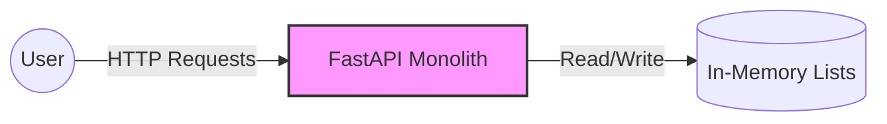
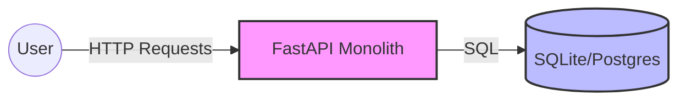
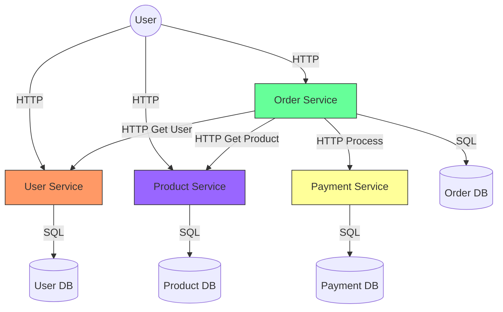
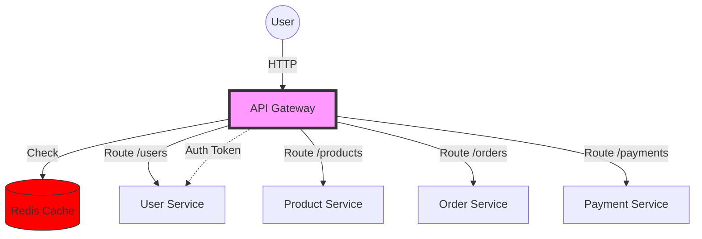
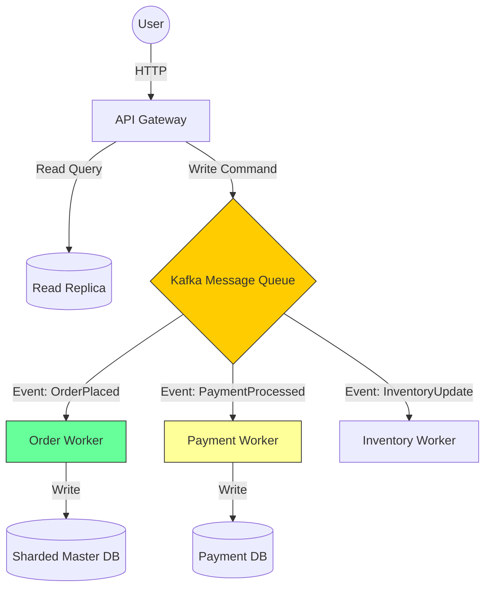
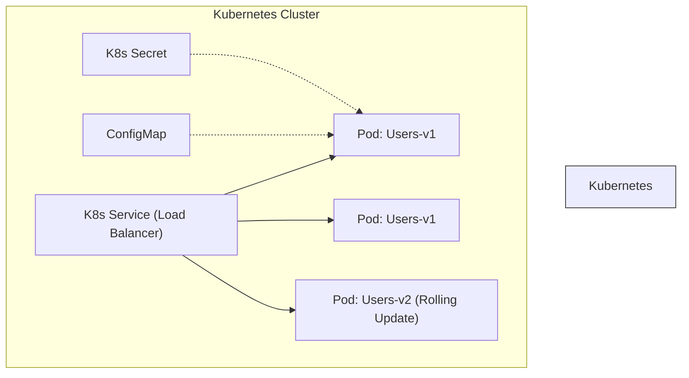
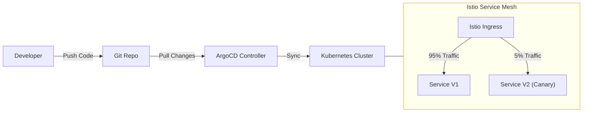
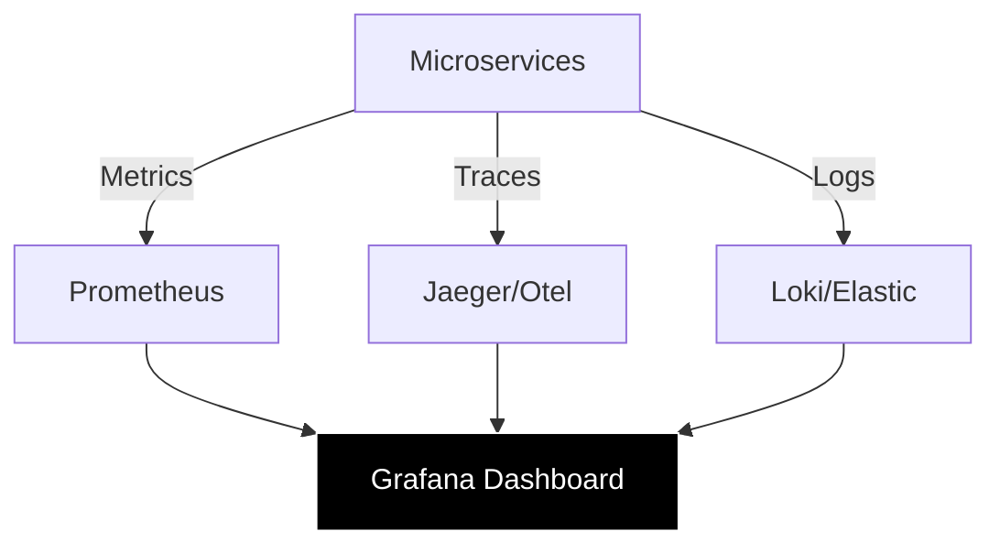
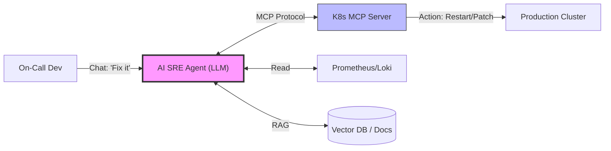

# E-Commerce Evolution: From 1 to 1 Million Users (+ AI SRE)

This project demonstrates the evolution of an e-commerce backend from a simple script to a complex, scalable microservices architecture. Each stage represents a branch in this repository.

## 📊 Progress Tracker
| Phase | Stage | User Scale | Description | Status |
| :--- | :--- | :--- | :--- | :--- |
| **Phase 1: App** | 1 (MVP) | 1 | **Monolith (In-Memory)**: Single script, no DB, fast proto. | ✅ Done |
| | 2 (Startup) | 100 | **Monolith + SQLite**: Persistent Data & SQLModel ORM. | ✅ Done |
| | 3 (Growth) | 1,000 | **Microservices**: Split into Users, Orders, Products services. | ✅ Done |
| | 4 (Scale)| 10,000 | **Gateway + Redis**: Unified Entry, Caching & Rate Limit. | ✅ Done |
| | 5 (Enterprise) | 1,000,000+ | **Event-Driven**: Kafka Messaging & DB Sharding. | ⏳ Planned |
| **Phase 2: Ops** | 6 (K8s) | 1M+ | **Kubernetes**: Orchestration, Self-Healing, Rolling Updates. | ⏳ Planned |
| | 7 (Mesh) | 1M+ | **Service Mesh**: Istio (Canary), mTLS, & ArgoCD (GitOps). | ⏳ Planned |
| | 8 (Observe) | 1M+ | **Observability**: Prometheus Metrics, Jaeger Traces, Logs. | ⏳ Planned |
| **Phase 3: AI** | 9 (AI SRE) | 1M+ | **AI Agent**: LLM-driven Automated Triage & Self-Healing. | ⏳ Planned |

## The Goal
Build a robust e-commerce platform with 4 core domains:
1.  **Users** (Auth, Profiles)
2.  **Products** (Catalog, Search)
3.  **Orders** (Cart, Checkout)
4.  **Payments** (Transactions, Inventory checks)

---

# Phase 1: Application Architecture Evolution

## 1. Stage 1: The MVP (1 User)
### **The Scenario**
You are a solo developer with a cool idea. You want to show it to a friend or an investor. You don't care about scaling, you care about speed of delivery.

### **The Problem**
Setting up databases, Docker, and cloud infrastructure takes time. You need something working *now*.

### **The Solution**
A **Monolithic Architecture** with **In-Memory Storage**.
*   **Why?**: It removes all infrastructure friction. No database to install, no network config. Just code.
*   **Trade-off**: If the server crashes, all data is lost. This is acceptable for a demo, but not for production.

### **Architecture Diagram**

---

## 2. Stage 2: The Startup (10-100 Users)
### **The Scenario**
Your MVP worked! You have your first 100 customers. They are placing real orders.

### **The Problem**
In Stage 1, every time you deployed a new feature, the server restarted and all user accounts were deleted. Customers are angry. You also need to run complex queries like "Show me all orders over $50", which is hard with simple lists.

### **The Solution**
**Persistance** (Relational Database).
We introduce **SQLite** (or PostgreSQL) and an **ORM** (SQLModel).
*   **Why?**: Data must survive server restarts. SQL allows for powerful querying and data integrity (foreign keys).
*   **Architecture Change**: The app is still a Monolith (one codebase), but it now talks to a file-based database.

### **Architecture Diagram**

---

## 3. Stage 3: The Growth (100-1,000 Users)
### **The Scenario**
You've grown. You now have a team of developers. One team works on the Product Catalog, another on Checkout.

### **The Problem**
*   **Team Friction**: The "Product" team keeps breaking the "Checkout" code because it's all in one file.
*   **Reliability**: A memory leak in the "Image Processing" feature crashes the entire server, stopping people from logging in.
*   **Scaling**: The "Search" feature is slow and needs a powerful CPU, but the "User Profile" feature is light. You have to pay for a powerful server for everything, which is wasteful.

### **The Solution**
**Microservices Architecture**.
We split the Monolith into 4 independent services: **Users**, **Products**, **Orders**, **Payments**.
*   **Why?**:
    1.  **Isolation**: If `Products` crashes, `Users` can still log in.
    2.  **Independent Scaling**: We can run 5 instances of `Orders` and only 1 of `Users`.
    3.  **Team Autonomy**: Different teams work in different folders/repos without conflict.
*   **How?**: We use **Docker Compose** to run them side-by-side. They communicate via **HTTP** (REST). `Orders` calls `Products` to get prices.

### **Architecture Diagram**

---

## 4. Stage 4: The Scale (10,000 Users)
### **The Scenario**
Marketing launch! Traffic spikes to 10,000 concurrent users.

### **The Problem**
*   **Exposed Surface**: Clients have to know too many URLs (`users:8001`, `orders:8003`). It's a security risk.
*   **Database Load**: The `Products` database is melting because 10,000 people are viewing the homepage every second.
*   **Security**: We are implementing "Login Check" logic in every single service. It's repetitive and prone to bugs.

### **The Solution**
**API Gateway & Caching**.
*   **API Gateway**: A single entry point (like Nginx or a custom Python Proxy). It routes traffic and handles authentication for everyone.
*   **Redis Cache**: We store popular product details in RAM (Redis). 
*   **Why?**:
    *   **Performance**: Reading from Redis is 100x faster than SQL.
    *   **Simplicity**: The frontend only talks to `http://api.ecommerce.com`.
    *   **Protection**: The Gateway can Rate Limit users (e.g., "Max 5 requests/second").

### **Architecture Diagram**

---

## 5. Stage 5: The Enterprise (1 Million+ Users)
### **The Scenario**
You are now Amazon-scale. You have millions of users.

### **The Problem**
*   **Synchronous Coupling**: When a user places an order, we wait for: Bank Validation + Inventory Check + Email Confirmation. This takes 5 seconds! The user sees a spinning wheel and leaves.
*   **Database Limits**: A single Postgres instance simply cannot write 50,000 orders per second.

### **The Solution**
**Event-Driven Architecture & Sharding**.
*   **Async Messaging (Kafka/RabbitMQ)**: When a user orders, we just say "Order Received" (instant). We publish an event `OrderPlaced`. Background workers handle the payment, email, and inventory later.
*   **Db Sharding**: We split the `Orders` database into `Orders_US`, `Orders_EU`, etc., or based on User ID ranges.
*   **Why?**:
    *   **User Experience**: Instant feedback.
    *   **Resilience**: If the Email service is down, the Order is still accepted. The Email worker will just retry later.

### **Architecture Diagram**

---

# Phase 2: Operations & Infrastructure Evolution

## 6. Stage 6: Kubernetes Migration
### **The Scenario**
Managing 20 containers with Docker Compose in production is a nightmare. Restarting them, checking their health, and deploying new versions with zero downtime is impossible manually.

### **The Solution**
**Kubernetes (K8s) Orchestration**.
*   **Action**: Convert `docker-compose.yml` to K8s Manifests (Deployments, Services, ConfigMaps).
*   **Why?**: K8s handles "Self-Healing" (restarts crashed pods), "Rolling Updates" (no downtime), and "Scaling" (automatically adds more pods if CPU is high).

### **Architecture Diagram**

## 7. Stage 7: Service Mesh & GitOps
### **The Scenario**
*   **Security**: How do we ensure `Orders` service only talks to `Products` securely?
*   **Traffic Control**: We want to release "Version 2" of the Checkout service to only 5% of users (Canary Release).
*   **Deployment**: Developers are manually running `kubectl apply`. Mistakes happen.

### **The Solution**
**Istio (Service Mesh) & ArgoCD (GitOps)**.
*   **Istio**: Provides mTLS (mutual TLS) encryption between services, advanced traffic splitting (Canary/Blue-Green), and retry logic transparently.
*   **ArgoCD**: Use Git as the "Source of Truth". Pushing to the `k8s-config` branch automatically updates the cluster.

### **Architecture Diagram**

## 8. Stage 8: Observability (The Eyes & Ears)
### **The Scenario**
A user says "My order failed", but the logs are scattered across 50 pods. You have no idea where the error happened.

### **The Solution**
**Full Observability Stack**.
*   **Metrics (Prometheus & Grafana)**: "Is CPU high? How many 500 errors per second?"
*   **Distributed Tracing (Jaeger/OpenTelemetry)**: Track a single request ID as it jumps from Gateway -> Order -> Product -> database.
*   **Logs (ELK/Loki)**: Centralized logging to search all service logs in one place.

### **Architecture Diagram**

---

# Phase 3: AI-Driven SRE & Self-Healing Infrastructure

## 9. Stage 9: The Agentic Infra (AI SRE)
### **The Scenario**
It's 3 AM. A Kubernetes Node crashes, causing the `Orders` service to timeout. The database connection pool is full. The on-call engineer is asleep or lacks context to fix it quickly.

### **The Problem**
*   **Human Latency**: Detecting, triaging, and fixing takes too long (MTTR is high).
*   **Skill Gaps**: Not every developer is a Kubernetes expert. They struggle to interpret `kubectl describe pod`.
*   **Manual Toil**: Repeatedly running the same diagnostic commands (Logs, Describe, Top) is tedious.

### **The Solution**
**Agentic AI & MCP (Model Context Protocol)**.
We deploy an **AI SRE Agent** that lives inside the cluster (or connects to it).
*   **Kubernetes MCP Server**: Allows the LLM to run `kubectl` commands safely (read-only first, then modify with permission).
*   **Self-Healing**: The Agent sees the error in the logs, queries the K8s state, identifies "OOMKilled", and suggests/applies a patch to increase memory limits.
*   **Smart Triage**: Non-experts can ask "Why is checkout failing?" in plain English. The Agent investigates and explains "The Payment service is returning 500 because the API Key is invalid."

### **Components**
1.  **AI SRE Agent** (Claude/OpenAI): The brain.
2.  **MCP Server**: The hands. Securely exposes K8s tools to the AI.
3.  **Vector DB**: Stores "Runbooks" and historical incident data for RAG (Retrieval-Augmented Generation).

### **Architecture Diagram**

